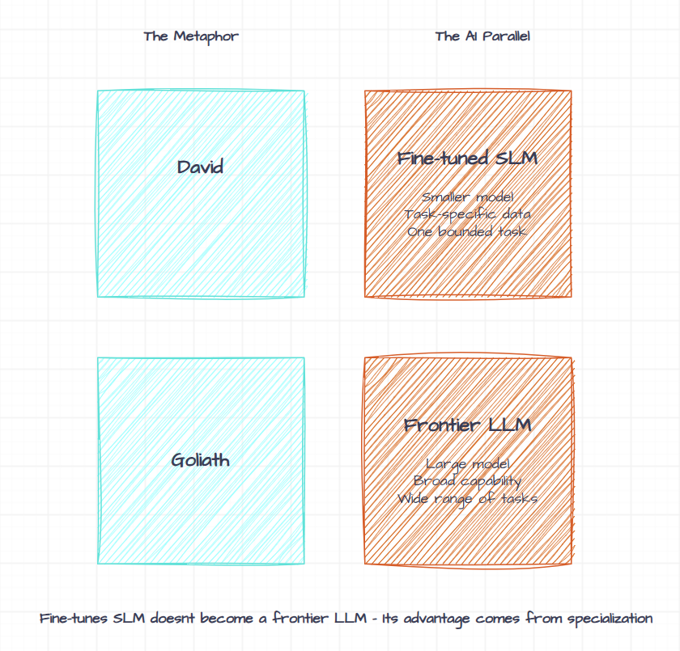
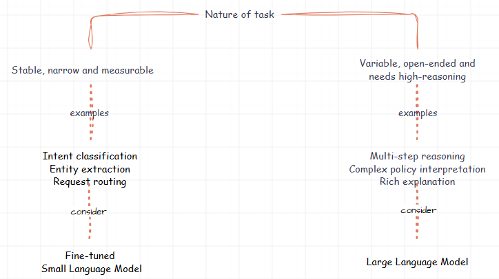
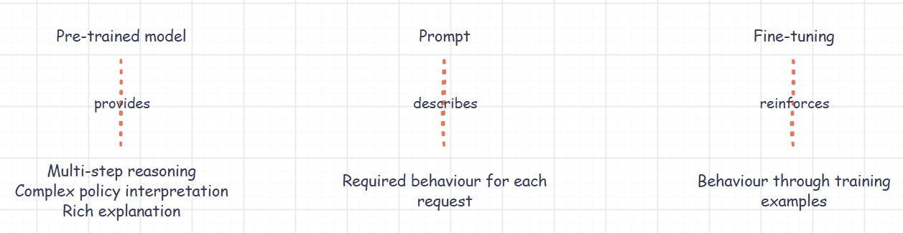
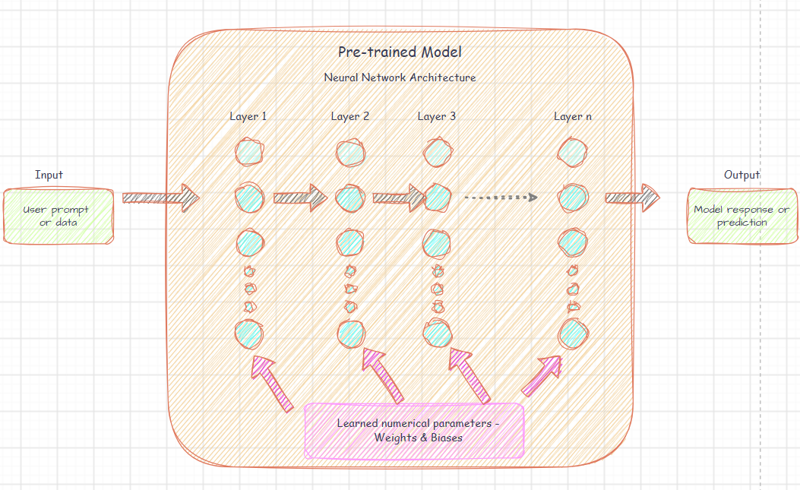
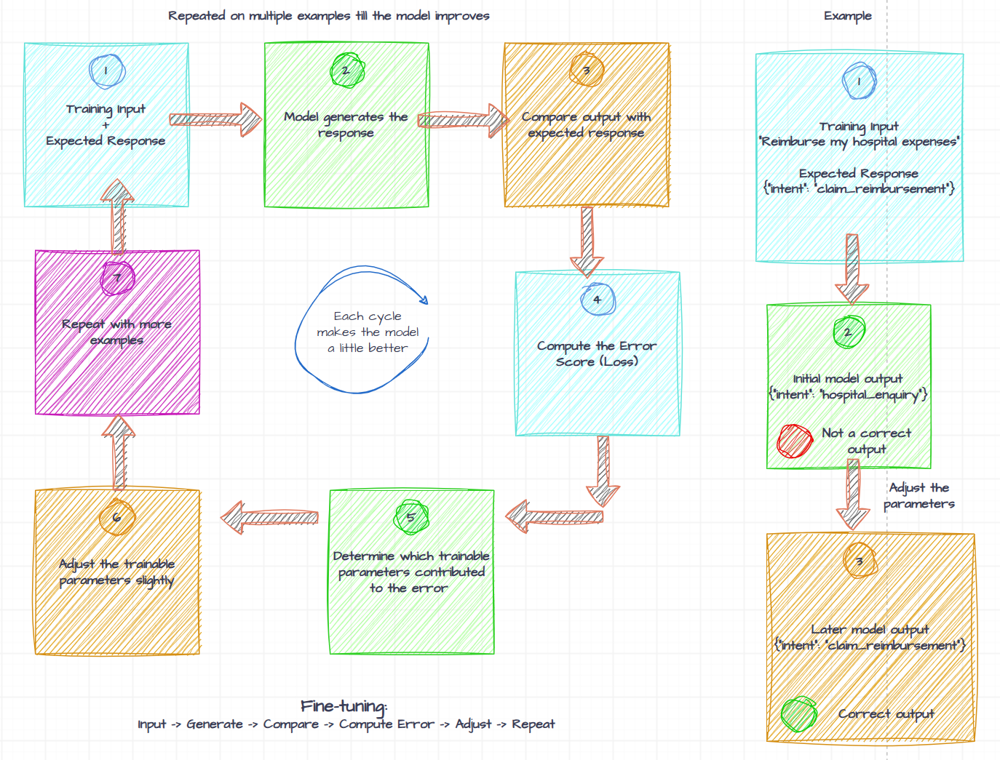
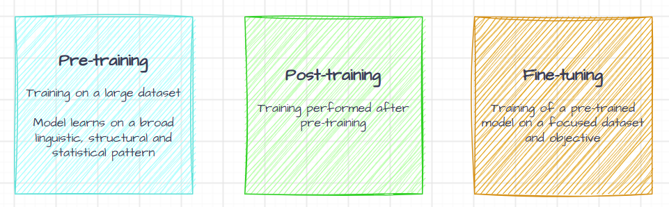
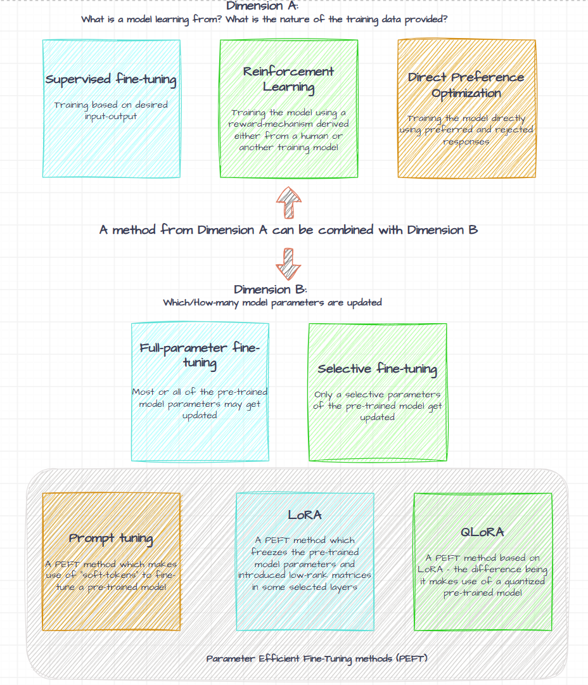
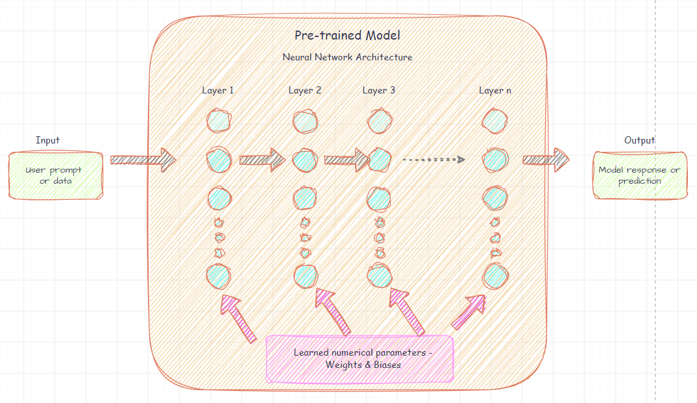
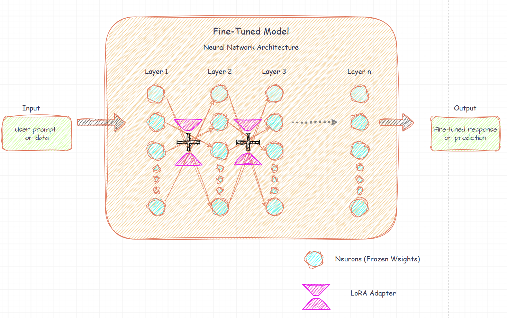
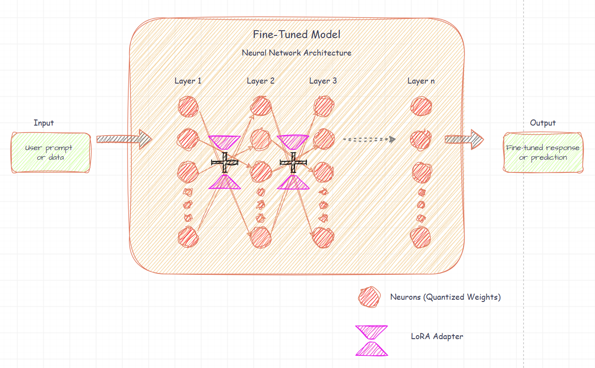

# The Making of David: How QLoRA Fine-Tuning Turns a Small Language Model into a Purpose-Built Specialist

Before delving into the topic, let’s disambiguate the title first :smile: .

The title draws from the story of David and Goliath—but with an
important qualification. A Small Language Model does not become more
capable than a frontier model in every dimension merely because it has
been fine-tuned. Its advantage comes from specialization.

David did not defeat Goliath by becoming larger or stronger. He
succeeded by being prepared for a specific encounter and by using a tool
suited to that encounter. In much the same way, **a fine-tuned Small
Language Model does not attempt to replace a much larger model for every
possible task. Instead, it is adapted to perform a clearly defined and
repeatable task efficiently**.

This two-part article explores how that specialization happens, with
particular emphasis on **Supervised Fine-Tuning** using **Quantized
Low-Rank Adaptation**, or **QLoRA**.   

## Intent and Disclaimer:

**The views expressed in this article are personal and do not represent
those of any company or organization.**

This article is divided into two parts. Part 1 introduces the
fundamental concepts behind fine-tuning, **LoRA** and **QLoRA**. Part 2
walks through a working prototype in which a Small Language Model is
fine-tuned for a health-insurance claim-intake scenario.

The two parts are intended to provide a conceptual and practical
introduction rather than a comprehensive guide to model fine-tuning.   

## Introduction:

### Why consider a Small Language Model?

Large Language Models can perform a broad range of tasks, but not every
application component requires open-ended reasoning. Some workloads are
narrow and repeatable, such as:

- classifying requests

- extracting predefined fields

- routing requests

- identifying cases that require escalation

For such tasks, a Small Language Model may offer a lower memory
footprint and potentially lower latency and cost.

Model size alone, however, does not establish suitability—the model must
still be evaluated against the required task.   

### When can prompting alone be insufficient and fine-tuning may be considered?

Prompting is usually the first technique to try on an SLM because it is
easy to experiment with and does not modify the model.

Fine-tuning may become worth considering when:

- you want to avoid lengthy instructions or examples accompanying every
  request

- a strict vocabulary must be followed repeatedly

- the required behaviour is stable, measurable and supported by
  representative training data.   

### From a general-purpose model to a specialist

A pre-trained model may already be capable of extraction, classification
and JSON generation, but it has not necessarily learned the
application’s precise behavioural contract.

For a health-insurance claim-intake component, that contract could be:

1.  Identify the customer’s intent

2.  Classify the claim type

3.  Extract the required entities

4.  Identify available and missing documents

5.  Route the request

6.  Decide whether escalation is required

7.  Return only the agreed JSON structure

Consider the following input to an input module of a claims system:

My name is Rajesh Kumar and my policy number is HLT10000. I was admitted
to Apollo Hospital from 1 January 2026 to 3 January 2026 because of
diabetes-related complications.

The expected response of the input module could be:

{

"intent": "claim_reimbursement_check",

"claim_type": "reimbursement",

"route": "claims_agent",

"patient_name": "Rajesh Kumar",

"policy_number": "HLT10000",

"hospital_name": "Apollo Hospital",

"needs_frontier_model": false

}

The input module’s role is not to conduct an open-ended conversation. It
must reliably transform an unstructured claim narrative into a
machine-readable contract for downstream components.   

### A sample decision tree: Fine-tuned SLM versus LLM

This decision tree is a starting point rather than a hard boundary. The
choice must be validated through evaluation. Model size alone does not
determine task capability.

Selecting an SLM does not automatically make it a specialist. Even when
it possesses the underlying capability, it may omit fields, vary label
names, add explanations around the JSON or interpret similar requests
inconsistently.

Prompt engineering may reduce these variations. When the required
behaviour is stable and repeated frequently, **fine-tuning** offers
another option - adapt the model using sample examples of the expected
inputs and outputs.

In simple terms:

This leads to the next question - **what happens inside a model during
fine-tuning**?   

## What fine-tuning means:

A pre-trained model generates an output by applying its learned
numerical parameters to the input through a neural network architecture.

Fine-tuning continues the training of a pre-trained model using a
smaller, more focused dataset representing a particular task or domain
[[1]](#references).

In the previous example, each training record would show the model the
below two things:

- an incoming health-insurance claim narrative

- the exact structured response expected for that narrative.

Across many such examples, the training process adjusts the model’s
trainable numerical parameters so that the desired response patterns
become more probable for similar inputs.

A simplified training cycle for fine-tuning looks like this:

Repeated updates gradually make the desired output patterns more
probable for inputs resembling the training data.

**Fine-tuning does not store each example as a conventional record
inside the model. Instead, the examples influence the model’s numerical
parameters, thereby changing the probability of the outputs it
generates.**   

## Disambiguation: Pretraining, post-training and fine-tuning

We usually come across many terms related to Language Models. So let’s
have the definition of those terms first before going ahead.

### Pre-training

Training a model on a very large and diverse corpus so that it learns
broad linguistic, structural and statistical patterns. The primary
objective of a causal language model is generally next-token prediction.

### Post-training

An umbrella term for training performed after pretraining. It can
include instruction tuning, preference optimization, safety alignment
and domain or task-specific adaptation.

### Fine-tuning

Continuing the training of a pretrained model using a more focused
dataset and objective to adapt its behaviour.

Kindly note –

What I observed is that the terminology is not used with perfect
consistency across papers, vendors and practitioner communities. **In
some contexts, “fine-tuning” refers broadly to most post-training
activities. In others, it refers specifically to supervised or
task-specific adaptation.** I also came across a term called
**mid-training** (sometimes done after the pre-training phase).   

## Types of fine-tuning, basis two different dimensions

**Fine-tuning types are based broadly on the below 2 mentioned
dimensions –**

**Dimension A:** What is the model learning from? What is the nature of
the training data provided?

**Dimension B:** Which/How-many model parameters are updated?   

For **Dimension A**, the key methods are as below –

**Supervised Fine-Tuning**

The model is trained using labelled examples of the desired input-output
behaviour. For an instruction-following model, these commonly take the
form of prompts or conversations paired with expected responses.

A simple example -

**Training input** – “Please reimburse my hospital expenses.”

**Expected output** – {“intent”: “claim_reimbursement”}

**Now the model initially produces the output** - {“intent”:
“hospital_enquiry”}

For this output the training process compares the model output with the
expected answer, calculates the loss and adjusts the trainable
parameters so that for the similar requests, **the output becomes** -
{“intent”: “claim_reimbursement”}   

**Reinforcement learning**

A reward signal derived from human or machine feedback is used to
optimize model behaviour. **RLHF** (Reinforcement Learning from Human
Feedback) is one prominent example [[2]](#references).

A simple example –

**The model receives the input** – “Please reimburse my hospital
expenses”

**The model generates** – Response A: {“intent”: “hospital_enquiry”}

**The evaluator assigns** – Reward: 0.2

**The model tries again and produces** – Response B: {“intent”:
“claim_reimbursement”}

**The evaluator assigns** – Reward: 1.0

The training encourages behaviour similar to Response B because it
received the higher reward.

Reinforcement learning tells the model how good its generated answer
was, not necessarily the exact response it should copy.   

**Direct Preference Optimization (DPO)**

DPO is a preference-optimization technique that directly trains the
model using preferred and rejected responses without requiring a
separately trained reward model in the original formulation [[3]](#references).

A simple example –

**Training input** – “Please reimburse my hospital expenses.”

Two responses are provided during the training –

**Preferred response**: {“intent”: “claim_reimbursement”}

**Rejected response**: {“intent”: “hospital_enquiry”}

**DPO trains the model so that** –

Probability-of-preferred-response \> Probability-of-rejected-response

Conceptually, the training objective encourage the model to assign a
higher relative likelihood to the preferred response than to the
rejected response.   

For **Dimension B**, the key methods are as below -

**Full-parameter fine-tuning**

Most or all of the pre-trained model parameters are trainable and may be
updated.   

**Selective fine-tuning**

Only selected existing layers or parameters of the pre-trained model are
made trainable.   

**Parameter-Efficient Fine-Tuning (PEFT)**

PEFT is an umbrella category of techniques that adapt a model by
training a comparatively small number of parameters [[4]](#references).

Examples include:

- Prompt tuning

- Low-Rank Adaptation (LoRA) / Quantized Low-Rank Adaptation (QLoRA)   

**Prompt tuning**

A PEFT method which makes use of “soft tokens” to fine-tune a
pre-trained model.

Please note this method is different than **prompt engineering**.

Soft tokens are trainable vectors added to the model’s input-embedding
sequence. They behave like additional prompt positions, but they do not
necessarily correspond to readable words or ordinary vocabulary tokens.

To further explain prompt tuning and soft tokens, consider the below
example:

**Normal prompt**: \[Classify\] \[this\]
\[insurance\] \[request\] + User input

**Prompt tuning:** \[Soft1\] \[Soft2\]
\[Soft3\] + User input

The soft tokens are additional instructions for the model – but they are
not the actual words which are readable.

These soft tokens are created during the process of fine-tuning while
the pre-trained model parameters remain frozen [[5]](#references).

**Low-Rank Adaptation (LoRA)**

A PEFT method that freezes the original weights and introduces trainable
low-rank matrices into selected layers – thereby modifying the model
behaviour [[6]](#references).

This bunch of low-rank matrices (also called as the LoRA Adapter) are
created during the process of fine-tuning and it creates an additional
trainable update that is combined with the original weights of the
pre-trained model. This LoRA Adapter guides the model behaviour.

**Quantized Low-Rank Adaptation (QLoRA)**

QLoRA is a memory-efficient fine-tuning approach that combines a frozen,
a 4-bit-quantized pre-trained model with trainable LoRA adapters.

The central difference LoRA and QLoRA is that in QLoRA the pre-trained
model parameters are first quantized (compressed into a lower precision
numerical format) and then the usual process of LoRA is carried out.
Quantization is done to reduce the memory usage.

**For the fine-tuning, a method from Dimension A can be combined with
Dimension B.**

Examples of such a combination:

- Supervised fine-tuning + LoRA

- Supervised fine-tuning + QLoRA

- Direct Preference Optimization + LoRA

The prototype that the part-2 of this article would zoom-in on would be
using **Supervised fine-tuning** as the learning approach and **QLoRA**
as the parameter and memory-efficient training technique.   

## LoRA: teaching through small trainable matrices

You may have been reading the term **parameters** appearing more
frequently in the article. So lets explain what that is before delving
into LoRA.

A language model contains a very large collection of numerical values
that influence how it processes an input and produces an output. These
learned values are called **parameters**.

Most of these parameters are **weights**. In linear operations,
**weights** are commonly stored as **two-dimensional tensors** called
**matrices**. A model can also contain **bias** values and other learned
parameters, including **embedding** and **normalization** parameters.

In simple terms -

**Weights**: Weights determine how strongly each input influences the
result

**Biases**: Biases provide an additional adjustment that helps the model
fit the desired output.

Same sample diagram depicting weights and biases, referenced earlier -  

Now that we have understood what weights and biases are, lets see how a
simple example operation using them looks like:

**y = Wx + b** – where x is the input, y is the output, W is the weight
and b is the bias.

If we change either the weight or the bias value, then it changes the
value of y (the output) for the same value of x (the input).

For simplicity – let’s say if we keep the bias unchanged and if we just
change the weight and call the new value of weight as W’, then the
operation now looks like:

**y = W’x + b**

Imagine a Language Model to be a collection of multiple such
interconnected operations and if we change the values of some weights,
biases or whichever other parameters which have been made trainable, we
are essentially modifying the output of the Language Model. Fine-tuning
is exactly this!

Essentially, if we have to change the behaviour of a Language Model, one
of the ways is by changing the weights, biases or any other trainable
parameters.

For simplicity, for the rest of the article, lets have weights as the
only trainable parameter.

Now, if we refer to the short description of LoRA we made earlier, the
original weights are frozen – that means we don’t touch the original
weights. Then how do we still modify the behaviour of the model?

How LoRA does it is it keeps the original weight matrix **W** (matrix –
because it is usually more than one value) and just “adds” the value of
the new weight **ΔW** matrix to the original weight matrix [[6]](#references).

Essentially it is NOT a replace action but more like an “add” operation
– so the new weight matrix W’ now looks like:  
**W’ = W + ΔW**

Below is an **indicative** diagram as to how the neural network of the
model fine-tuned using LoRA adapter looks like – note the Neurons with
frozen weights and the added LoRA Adapter:

So essentially, using LoRA, we keep the original weight matrix W as-is
(frozen) and just add a layer of change on top of it of value ΔW so that
the effective value changes to W’. The important thing here is that we
are NOT touching the original weights which are frozen but just adding
to it.

Note - The matrix ΔW is represented by LoRA as the product of two much
smaller trainable matrices – v.i.z. A and B. Essentially **ΔW = BA**.
There is also a multiplication factor of **α** (strength of LoRA update)
and **r** (rank) [[6]](#references). Kindly note that the labels of **A** and **B**
may differ across papers and implementations.

I will cover more on this in the next article.

Now that we have a foundational understanding of LoRA, we still have not
covered one point - what exactly does the word **Rank** in LoRA stands
for?

The Rank (r) controls the size of the low-dimensional space used to
represent the weight update. Increasing **r** will result in the LoRA
adapter to have more trainable parameters (and hence more capacity). In
LoRA typically the value of **r** is a low value and hence the name
Low-Rank Adaptation. In our prototype which I will be explaining in the
part-2 of this article, I have taken the value of r as 8.   

## QLoRA: quantize the base, train the adapters

In LoRA the entire pre-trained model parameters are loaded in the GPU
memory for the computation of the LoRA adapter parameters (ΔW). These
pre-trained model parameters are usually 16 or 32 bits in size and hence
if the number of pre-trained model parameters are too high, then the GPU
memory needed would also be high.

In QLoRA, the pre-trained model is **Quantized** while training the LoRA
adapter parameters [[7]](#references). Essentially, what Quantization means is the
parameters of the pre-trained model are stored usually in a lower
precision – **say 4 bits instead of the original 16 bit or 32 bits**.
Due to this the GPU memory needed is comparatively less. The precision
of using 4-bit quantization is followed [[8]](#references).

A very simple (and rough :smile: ) analogy is - having a high-resolution image
shrunk to a lower resolution for reducing the file size. The analogy is
imperfect, but in both cases a more compact representation trades some
numerical detail for reduced storage.

Below is an **indicative** diagram as to how the neural network of the
model fine-tuned using LoRA adapter looks like using the Quantized
parameters of the pre-trained model – note the Neurons with
**quantized** weights and the added LoRA Adapter:

Storing model weights with lesser precision may reduce model quality.

So the obvious question comes – if one is reducing the precision of the
base model by performing quantization, and then the LoRA adapter
parameters are calculated, aren’t we compromising on the quality of the
output since the precision of the pre-trained model weights is getting
reduced?

How this is handled is by **De-Quantization**. What this essentially
means is that the base model is in a lower precision, but the moment the
LoRA adapter weights are to be calculated during training (or if other
operations are to be carried during inferencing), the particular block
of quantized pre-trained model parameters get reconstructed to their
temporary approximate de-quantized representation to the 16-bit values
(such as FP16 or BF16) and uses that temporary approximate de-quantized
representation for the calculation. After the operation is done (LoRA
parameters computation or inferencing related operation is performed),
then the temporary compute values can then be discarded and the
de-quantized weights are not changed and remain available [[9]](#references).

Another simple analogy to help explain this – imagine you are reading a
large book, you will de-quantize (increase precision) of only that page
which you are currently reading, and the rest of the pages stay in the
quantized form. Poor analogy maybe but I hope you get the idea :smile: .

Another question should now crop up – how one knows to what value should
the de-quantization take place of a quantized weight? Example – if the
original weight is 0.12 and the quantized weight in 4-bit is 6 (0110),
then how does it know that during the de-quantization the value of 6
(0110) should be converted to 0.12 and not to any other value?

This problem is partially addressed by QLoRA using **NF4** (specialized
4-bit numerical datatype). NF4 chooses its representative values based
on a normal-distribution assumption [[7]](#references) [[10]](#references). So does it mean if we
use NF4, would the de-quantization happen to the exact same original
value? The answer is not always. But what NF4 does is it will
de-quantize to the nearer approximate value. Quantization introduces
approximation error (**Quantization error**), although well-designed
methods often preserve much of the model’s useful behaviour.

Illustrative – not an actual NF4 encoding example – if the original
value of the weight is 0.1371 and the quantized weight becomes 6 (0110),
the de-quantized or reconstructed weight becomes 0.1379.

In other words, most of the concepts discussed in the previous section
of LoRA stay the same. The only additional concept in QLoRA is that of
quantization of the weights of the pre-trained model.

There is also a concept of double quantization in QLoRA, where the
quantization constants or scaling information used by the first
quantization step are further quantized to further reduce the memory
consumption – but I wont delve into that for the sake of brevity and to
save you from my analogies :smile: .   

## Conclusion:

Fine-tuning does not add parameters to a model to make it compete with a
larger model on every possible task. It changes selected parameters—or,
in the case of **LoRA**, learns a small set of additional parameters—so
that behaviours become more likely for a defined class of inputs.

**LoRA** makes this adaptation parameter-efficient by keeping the
original model weights frozen and learning low-rank updates. **QLoRA**
reduces the training-memory requirement further by using a frozen,
4-bit-quantized representation of the base model while training the LoRA
adapters.

David’s advantage, therefore, does not come from becoming Goliath. It
comes from being purpose-built for a particular encounter.

This distinction also defines the limits of fine-tuning. A specialized
SLM should not automatically be treated as a replacement for a frontier
model. It is most useful when the task is bounded, the desired behaviour
can be represented through good examples, and success can be measured
objectively.

Part 2 of this article will move from this conceptual foundation to
implementation. It will walk through the dataset, QLoRA configuration,
training process, adapter artifacts, inference API and evaluation
approach used to fine-tune a Small Language Model for structured
health-insurance claim intake.   

## Thank you  
Thank you to Siddhesh Dosi (https://github.com/git-siddhesh) for all the reviews and help.   

## References

\[1\] Hugging Face, “SFT Trainer,” *TRL Documentation*.  
<https://huggingface.co/docs/trl/en/sft_trainer>

\[2\] L. Ouyang et al., “Training Language Models to Follow Instructions
with Human Feedback,” 2022.  
<https://arxiv.org/abs/2203.02155>

\[3\] R. Rafailov et al., “Direct Preference Optimization: Your Language
Model Is Secretly a Reward Model,” 2023.  
<https://arxiv.org/abs/2305.18290>

\[4\] Hugging Face, “Parameter-Efficient Fine-Tuning,” *PEFT
Documentation*.  
<https://huggingface.co/docs/peft/en/index>

\[5\] Hugging Face, “Soft Prompts,” *PEFT Documentation*.  
<https://huggingface.co/docs/peft/en/conceptual_guides/prompting>

\[6\] E. J. Hu et al., “LoRA: Low-Rank Adaptation of Large Language
Models,” 2021.  
<https://arxiv.org/abs/2106.09685>

\[7\] T. Dettmers et al., “QLoRA: Efficient Finetuning of Quantized
LLMs,” 2023.  
<https://arxiv.org/abs/2305.14314>

\[8\] Hugging Face, “Quantization,” *PEFT Documentation*.  
<https://huggingface.co/docs/peft/developer_guides/quantization>

\[9\] Hugging Face, “Bitsandbytes,” *Transformers Documentation*.  
<https://huggingface.co/docs/transformers/quantization/bitsandbytes>

\[10\] Hugging Face, “4-bit Quantization,” *bitsandbytes
Documentation*.  
<https://huggingface.co/docs/bitsandbytes/reference/nn/linear4bit>
